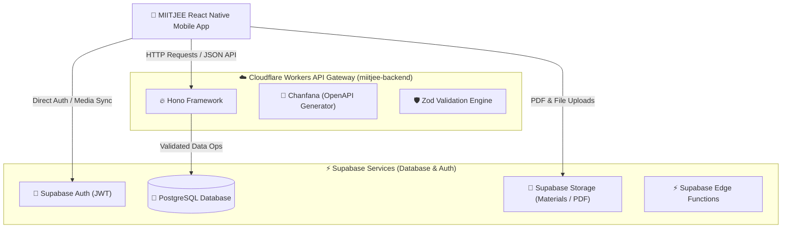

# 🏗️ MIITJEE Unified Backend Architecture

This document describes the backend architecture for the **MIITJEE Classes Mobile Platform**, detailing how the **Cloudflare Workers API Gateway** and **Supabase Database & Authentication** work together to serve the mobile client.

---

## 1. 🌐 System Overview

The backend uses a **hybrid microservices & serverless architecture**:



---

## 2. 🧩 Backend Components & Responsibilities

### A. Cloudflare Workers API (`/miitjee-backend`)
- **Technology**: Hono Framework (`hono`), Chanfana (OpenAPI specs), Zod (Request validation), Wrangler.
- **Responsibilities**:
  - Main API gateway for mobile app requests (Tests, Leaderboards, Admin functions, Banners, Announcements).
  - Business logic execution, scoring algorithms, and test session management.
  - Automatic OpenAPI / Swagger UI documentation generation.
  - Fast edge caching and low-latency global response times.

### B. Supabase (`/supabase`)
- **Technology**: PostgreSQL Database, Row-Level Security (RLS), Supabase Auth, Storage Buckets, Edge Functions.
- **Responsibilities**:
  - Primary relational data store (`students`, `tests`, `results`, `questions`, `admin_users`).
  - Secure user authentication (JWT-based authentication tokens).
  - File/asset storage for test question diagrams, study PDFs, and avatar uploads.
  - Database migrations (`supabase/migrations`).

---

## 3. 🔄 Data Flow & API Communication

### 1. Authentication Flow
1. Mobile app authenticates directly via Supabase Auth client or auth endpoints.
2. Supabase issues a JWT access token to the mobile client.
3. The mobile client includes the bearer token (`Authorization: Bearer <token>`) in subsequent HTTP requests sent to the Cloudflare Workers API.

### 2. Test Execution Flow
1. Client fetches active test list from Cloudflare Workers API (`GET /endpoints/tests`).
2. Client submits test answers upon completion (`POST /endpoints/tests/submit`).
3. Cloudflare Worker validates payload with Zod, evaluates score/percentile, writes result to PostgreSQL, and returns instant performance feedback to student.

---

## 4. 📁 Folder Structure

```
miitjee-backend/
├── src/
│   ├── endpoints/       # Route handlers & OpenAPI endpoints
│   ├── env.d.ts         # Environment binding definitions
│   ├── index.ts         # Hono app initialization & middleware
│   └── types.ts         # Shared TypeScript interfaces
├── package.json
├── wrangler.jsonc       # Cloudflare Workers configuration
└── tsconfig.json

supabase/
├── config.toml          # Supabase CLI config
├── functions/           # Edge functions
└── migrations/          # PostgreSQL schema migrations
```

---

## 5. 🛠️ Local Development & Deployment Commands

### Cloudflare Workers API
```bash
# Start local development server (Wrangler dev)
cd miitjee-backend
npm run dev

# Deploy to Cloudflare Workers
npm run deploy
```

### Supabase
```bash
# Apply migrations locally
supabase db reset

# Deploy migrations to production
supabase db push
```

---
*Documentation maintained by MIITJEE Development Team.*
